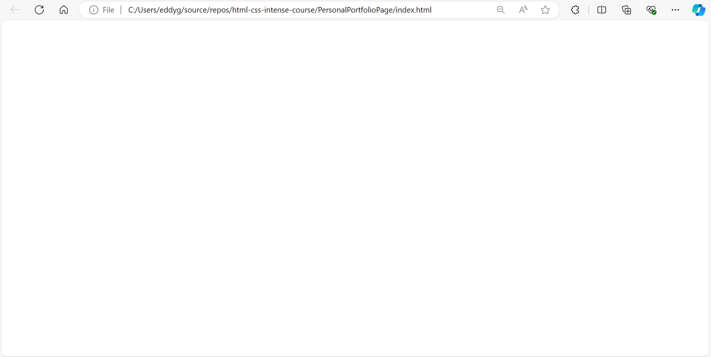
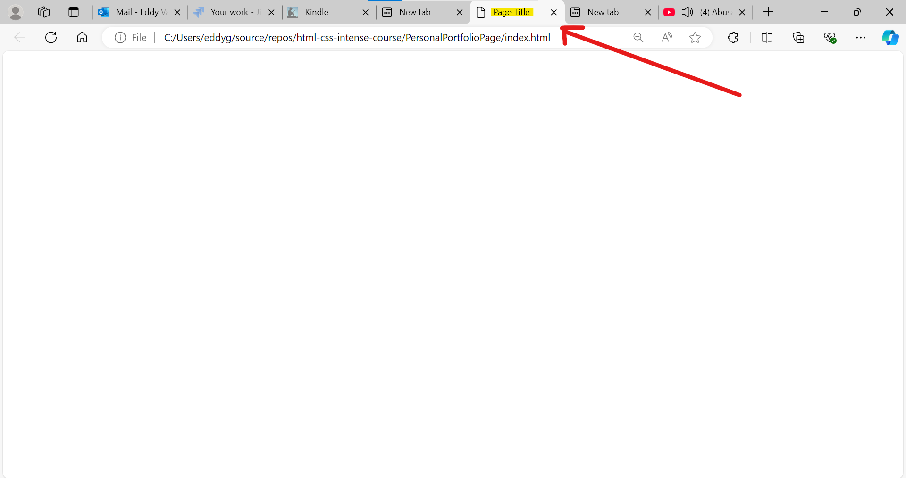
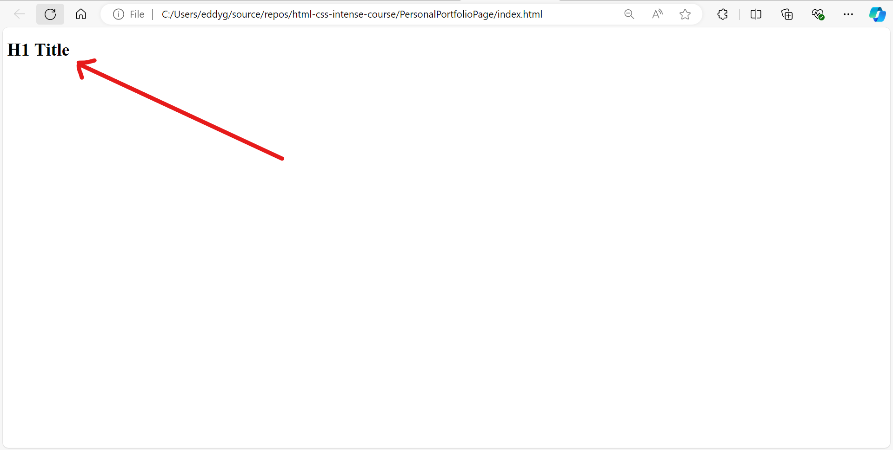
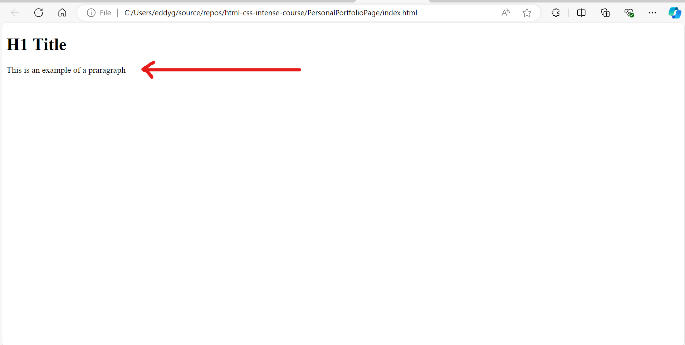
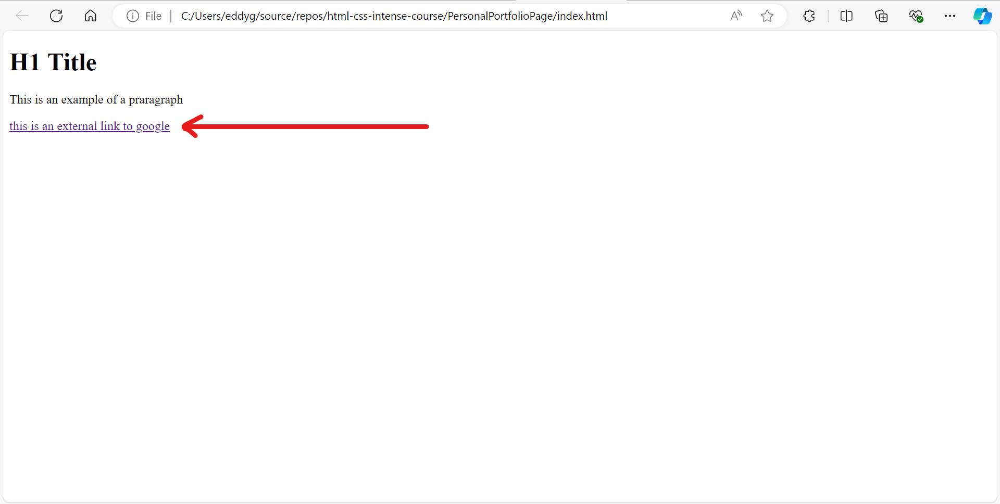
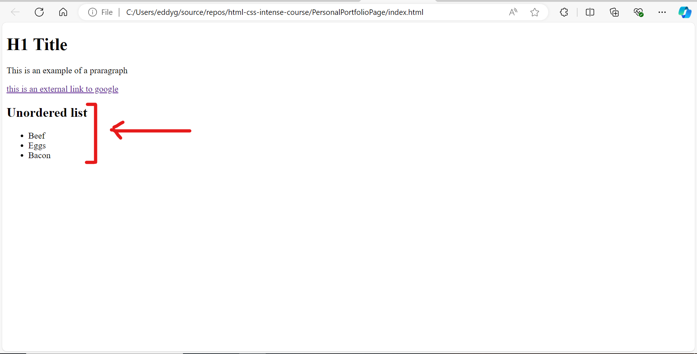
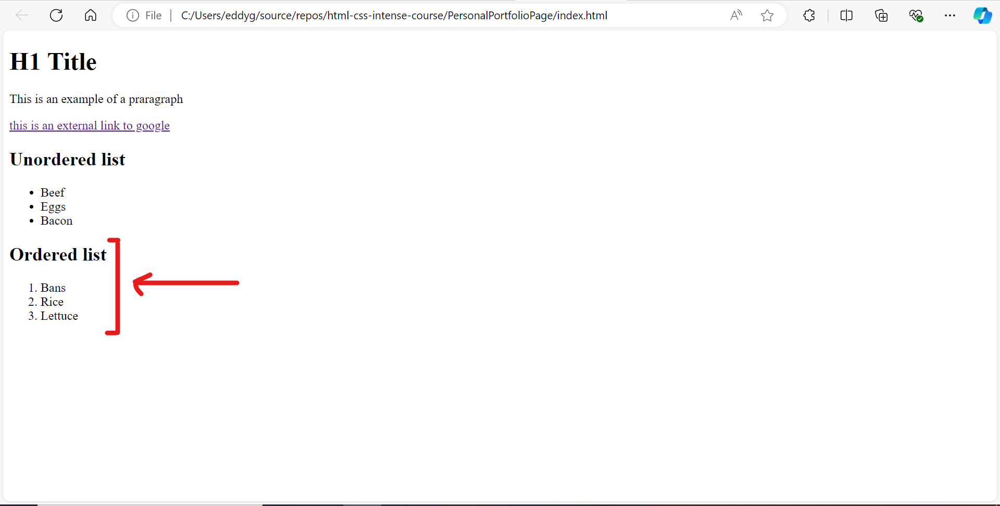
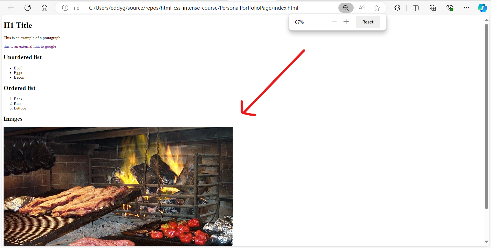

# html-css-intense-course
A collection of HTML and CSS projects for learning and practicing responsive web design and modern frontend techniques.

## Step 1: Add main structure

```html
<!DOCTYPE html>
<html>
    <head>
    </head>

    <body>
    </body>
</html>
```

It should look like his



## Step 1: Add title
```html
...
    <head>
        <title>Page Title</title>
    </head>
...
```

It should look like his



## Step 2: Add H1 tag title
```html
...
    <body>
        <h1>H1 Title</h1>
    </body>
...
```
It should look like his



## Step 3: Add p tag paragraph
```html
...
        <h1>H1 Title</h1>
        <p>This is an example of a praragraph</p>
    </body>
...
```
It should look like his


## Step 4: Add external link
```html
...
        <p>This is an example of a praragraph</p>
        <a href="https://google.com">this is an external link to google</a>
    </body>
...
```
It should look like his


## Step 5: Open link in a new tab
```html
...
        <p>This is an example of a praragraph</p>
        <a href="https://google.com" target="_blank">this is an external link to google</a>
    </body>
...
```

## Step 6: Add unordered list
```html
...
        <a href="https://google.com" target="_blank">this is an external link to google</a>
            <h2>Unordered list</h1>
                <ul>
                    <li>Beef</li>
                    <li>Eggs</li>
                    <li>Bacon</li>
                </ul>
    </body>
...
```

It should look like his



## Step 7: Add ordered list
```html
...
                </ul>
                <h2>Ordered list</h2>
                <ol>
                    <li>Bans</li>
                    <li>Rice</li>
                    <li>Lettuce</li>
                </ol>                
    </body>
...
```
It should look like his



## Step 8: Add Image
```html
...
                    </ol>     
                <h2>Images</h2>    
                                
    </body>
...
```

It should look like his
